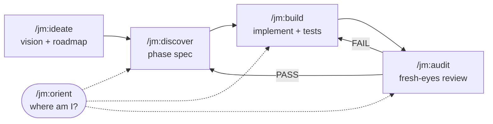

# jm

**Build big things with [Claude Code](https://claude.com/claude-code) — complete, robust, and phase by phase. No scope cuts, no half-finished work, no lost context.**

`jm` is a small Claude Code plugin: five *skills* (slash commands) that turn a vague idea into a finished, robust product. It works by breaking the work into **phases**, building each one to a high bar in its own clean session, and keeping every bit of project state on disk — so any fresh session can pick up exactly where the last one stopped.

It is opinionated on purpose. Its prime directive:

> **The final product is complete and perfect. Nothing is ever silently dropped — it is decomposed into more work.**

Once installed, the commands are namespaced under `jm`: `/jm:ideate`, `/jm:discover`, `/jm:build`, `/jm:audit`, `/jm:orient`.

---

## Why

Building something big with an AI agent tends to fail in three ways:

- **Scope quietly shrinks.** "I'll stub this for now", "v1 is fine", "good enough" — and the finished thing is full of holes.
- **Context rots.** One long session drifts, forgets earlier decisions, and quality falls off a cliff.
- **You lose your place.** Come back tomorrow and neither you nor the agent remembers where things stood.

`jm` fixes each of these with a **method, not a model**:

- A **constitution** that forbids cuts and reframes "later" as "a new phase" — never a deletion.
- **Phases** = vertical slices, each built and verified in its own fresh, clean-context session.
- A **`.jm/` folder** in your repo that is the single source of truth — any new session reconstructs the full state by reading it.

---

## Quick start

In Claude Code:

```
/plugin marketplace add javimoya/jm
/plugin install jm@jm
```

Then, **inside the folder of the project you want to build**, run:

```
/jm:ideate      # turn your idea into a vision + a roadmap of phases
```

Every step ends with a one-line breadcrumb telling you exactly what to run next.

> Stuck, or returning after a break? Run **`/jm:orient`** — it reads your project and tells you where you are and what to do next. It changes nothing.

> Prefer not to use the plugin system? See **[Alternative install](#alternative-install-without-the-plugin)** below.

---

## How it works



You move through a project **one phase at a time**. A phase is a vertical slice — something you can actually run and see — and it goes through three stages, each in its **own clean Claude session** (use `/clear` between them so context stays sharp):

1. **Discover** (`/jm:discover`) — interrogates you until the phase is a precise, **testable spec**.
2. **Build** (`/jm:build`) — implements that spec to the highest bar, with real tests, checkpointing as it goes.
3. **Audit** (`/jm:audit`) — an independent, fresh-eyes review that hunts for shortcuts and **can fail the phase**, sending it back to build.

`/jm:ideate` runs once at the start (and again later to add features); `/jm:orient` is your GPS at any time.

---

## The skills

| Command | Role | When you run it |
|---|---|---|
| **`/jm:ideate`** | Ideation & kickoff — produces the vision and the roadmap of phases. Also extends an in-progress project with new features. | Starting a project, or adding a big new idea. |
| **`/jm:discover`** | Turns one roadmap phase into a testable SPEC (acceptance criteria, deliverable, task plan). | At the start of each phase. |
| **`/jm:build`** | Implements the phase's SPEC to the highest bar, one task at a time, with tests. | After the SPEC is approved. |
| **`/jm:audit`** | Independent fresh-eyes audit. PASS closes the phase; FAIL sends it back. | After a phase is built. |
| **`/jm:orient`** | Read-only GPS. Reconstructs where you are and what's next. Changes nothing. | Any time you're lost or returning. |

---

## What it creates: the `.jm/` folder

Everything the workflow knows lives in a `.jm/` folder at the root of your project. This is the durable memory that lets clean sessions hand off to each other:

```
.jm/
├── PRINCIPLES.md      # the constitution (the quality bar) — copied at kickoff
├── VISION.md          # the complete destination: what "done and perfect" means
├── ROADMAP.md         # the phases, their status and dependencies (the dispatch table)
├── CONTEXT.md         # a glossary of your project's domain terms
├── JOURNAL.md         # append-only history: one entry per work session
├── adr/               # Architecture Decision Records (the "why" behind big calls)
└── phases/
    └── NN-slug/
        ├── SPEC.md      # the phase's testable contract
        ├── PROGRESS.md  # build checkpoint (which task is next, where to resume)
        └── HANDOFF.md   # what was built + how to verify + audit verdict
```

Commit this folder alongside your code. Anyone — you tomorrow, a teammate, a fresh agent — can `/jm:orient` and continue.

---

## The phase lifecycle

Each phase moves through a strict state machine, tracked in `ROADMAP.md`:

```
pending → discovering → spec-ready → implementing → auditing → done
```

- `blocked` can be entered from any state (with a reason).
- The only step backward is `auditing → implementing` — an audit **FAIL**.

This is what lets the skills self-route: run `/jm:build` on a phase that isn't ready and it stops and points you to `/jm:discover`.

---

## The rules that make it work

Enforced by `PRINCIPLES.md` (the constitution) and the skills:

- **Decompose, don't drop.** If something is "for later", it becomes a new phase or task — never a silent cut. The roadmap may grow; the product's quality bar never drops.
- **Verify before you claim.** Record a test baseline before you start; run the real deliverable before calling it done; an independent audit confirms it.
- **Clean context per step.** Each stage runs in a fresh session and hands off through `.jm/`, so quality never degrades inside a bloated session.
- **Resumable everywhere.** Long discovery or long builds can be cut mid-way and continued — open questions and "where to resume" are written down.

---

## Managing the plugin

```
/plugin marketplace update jm     # pull the latest version
/plugin                           # open the menu to enable/disable/uninstall
/plugin marketplace remove jm     # remove the marketplace entirely
```

Developing locally? Point the marketplace at your checkout instead of GitHub:

```
/plugin marketplace add /path/to/jm
/plugin install jm@jm
```

---

## Alternative install (without the plugin)

If you'd rather not use the plugin system, the `install.sh` script copies the skills straight into your Claude Code skills directory (`~/.claude/skills/`):

```bash
git clone https://github.com/javimoya/jm.git
cd jm
./install.sh          # CLAUDE_SKILLS_DIR=/custom/path ./install.sh to override
./uninstall.sh        # to remove them again
```

It's safe to re-run: any existing skill of the same name is backed up to `<name>.bak.<timestamp>` first.

**One difference to know:** the plugin namespaces commands as `/jm:build`. The manual install drops them in as personal skills, so the commands are the **bare verbs** — wherever this README says `/jm:build`, use `/build`:

| Plugin | Manual install |
|---|---|
| `/jm:ideate` | `/ideate` |
| `/jm:discover` | `/discover` |
| `/jm:build` | `/build` |
| `/jm:audit` | `/audit` |
| `/jm:orient` | `/orient` |

Because those bare names are generic, they can collide with other skills you've installed — the plugin method namespaces them and avoids that, so prefer it unless you have a reason not to.

### Requirements

- [Claude Code](https://claude.com/claude-code) — CLI, desktop app, or IDE extension.
- The skills request Opus with high effort by default (`model:` / `effort:` in each `SKILL.md`); edit those fields to taste.

---

## Customizing

- **`jm` is the command namespace** (so `/jm:build` etc.); `.jm/` is the state folder in your projects.
- Everything is plain Markdown — open any skill's `SKILL.md` or the `skills/jm-shared/*-FORMAT.md` templates and adjust the wording, the bar, or the document formats to fit your team.

---

## FAQ

**Is this a library or framework I import?** No. It's a set of instructions (Markdown) that steer Claude Code. There's no runtime, no dependency, nothing to import.

**Does it work for any language/stack?** Yes — it's stack-agnostic. The skills talk about specs, tests, and deliverables; you bring the language.

**Do I have to use all five?** The four working skills form the loop (ideate → discover → build → audit). `/jm:orient` is optional but handy.

**Why clean sessions / `/clear` between steps?** Long sessions degrade. Each step is sized to fit one fresh session, and the `.jm/` files carry state across, so you always work with a sharp context.

---

## License

MIT — see [LICENSE](LICENSE).
